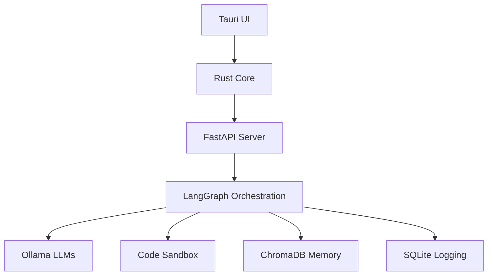

# 🚀 Local Agentic Automation System

**A local-first, privacy-respecting desktop application where AI agents autonomously understand natural language prompts to plan, execute, and adapt automation tasks on your machine.**

 <!-- Replace with actual banner later -->

> **Your personal automation assistant that works offline, respects privacy, and adapts to your needs**

## ✨ Core Philosophy

|         Principle          |                Description                            |
|----------------------------|-------------------------------------------------------|
|**🤖 Agentic Autonomy**     | AI agents handle task lifecycle independently        |
|**🔒 Local-First Privacy**  | All processing stays on your device - no data leaves |
|**🧩 Dynamic Adaptation**   | Code generated on-the-fly for each unique task       |
|**🛡️ User-in-the-Loop**     | Explicit consent required for sensitive actions      |
|**📱 Hardware Accessible**  | Works from basic laptops to powerful workstations    |

## 🚀 Key Features

- **Natural Language Interface**: "Remind me to water plants every Tuesday at 5 PM"
- **Self-Improving Memory**: Learns from successful tasks via ChromaDB vector store
- **Tiered Security Model**:
  - AST-based static code analysis
  - Resource-limited sandbox execution
  - Granular consent gates
- **Hardware Optimization**: 
  - Automatic model selection (Phi-3 to Llama 3)
  - GPU acceleration support
- **Cross-Platform**: Native desktop experience for Windows, macOS, Linux

## 🧩 Tech Stack Architecture



## ⚙️ System Requirements

### Minimum (Basic Automation)
- CPU: x86-64-v2 (Intel Sandy Bridge+/AMD Bulldozer+)
- RAM: 8GB DDR4
- Storage: 128GB SSD
- Recommended Model: `phi3` (1.8GB)

### Recommended (Advanced Tasks)
- CPU: 6-core/12-thread (Zen2+/Raptor Lake+)
- RAM: 16GB DDR5
- GPU: NVIDIA RTX 3060/AMD RX 6600XT
- Storage: NVMe SSD
- Recommended Model: `llama3:8b` (4.7GB)

## 🚀 Getting Started

### 1. Prerequisites
```bash
# Install core dependencies
curl --proto '=https' --tlsv1.2 -sSf https://sh.rustup.rs | sh  # Rust
brew install ollama docker node   # macOS
sudo apt install docker-compose nodejs npm  # Linux
```

### 2. Clone & Setup
```bash
git clone https://github.com/your-username/local-automation-agent.git
cd local-automation-agent

# Initialize environment
./setup.sh
```

### 3. Configure Environment
```bash
# Edit .env file for customization
nano .env

# Example configuration:
OLLAMA_MODEL=phi3
SANDBOX_TIMEOUT=30
RISK_THRESHOLD=medium
```

### 4. Launch the System
```bash
# Start backend services in Docker
docker-compose up --build -d

# Launch desktop UI
cd frontend
npm install
npm run tauri dev
```

### 5. Try Your First Automation
Enter in the prompt window:
```text
"Create a daily journal template in Markdown format on my Desktop"
```

## 📂 Project Structure Deep Dive

```
local-automation-agent/
├── backend/                  
│   ├── app/                  
│   │   ├── agent_orchestration/  # LangGraph workflows
│   │   │   ├── graph.py          # State machine definition
│   │   │   ├── nodes/            # Processing units
│   │   │   └── state_models.py   # Data structures
│   │   ├── services/             
│   │   │   ├── sandbox_service.py # Execution environment
│   │   │   ├── llm_service.py    # Ollama interface
│   │   │   └── security.py       # Risk assessment
│   │   └── api/                  # REST endpoints
│   └── Dockerfile                # Container configuration
├── frontend/                 
│   ├── src/                  # UI components
│   │   ├── services/         # Tauri-Rust communication
│   │   └── stores/           # State management
│   └── src-tauri/            # Rust core
│       └── src/              
│           ├── commands.rs   # Bridge handlers
│           └── keychain.rs   # Secure credential storage
├── data/                     # Persistent storage
│   ├── chroma/               # Vector database
│   └── sqlite/               # Task history
└── workspace/                # Ephemeral execution space
```

## 🔧 Troubleshooting Guide

### Common Issues:
1. **Ollama Connection Failed**:
   ```bash
   docker-compose logs ollama
   curl http://localhost:11434/api/tags # Verify Ollama status
   ```
   
2. **Sandbox Timeout Errors**:
   - Increase `SANDBOX_TIMEOUT` in `.env`
   - Check for infinite loops in generated code

3. **GPU Acceleration Not Working**:
   ```bash
   docker run --gpus all nvcr.io/nvidia/k8s/cuda-sample:nbody nbody -gpu -benchmark
   ```
   Verify NVIDIA toolkit installation

### Performance Tuning:
```bash
# For low-RAM systems
export OLLAMA_MODEL=phi3:4k-q4
export SANDBOX_MEMORY_LIMIT=512

# Enable GPU acceleration
export LLAMA_CUDA=1
```

## 🌟 Sample Automations

### File Management
```text
"Find all .tmp files in Downloads older than 30 days and delete them"
```

### Data Processing
```text
"Convert the sales-data.csv in Documents to a pivot table Excel file"
```

### Personal Productivity
```text
"Create calendar events for all meetings mentioned in my email from yesterday"
```

## 🗺️ Development Roadmap

|     Phase     | Features                               | Status         |
|---------------|----------------------------------------|----------------|
| **Phase 1**   | Core NLP-to-Code pipeline              | ✅ Released    |
| **Phase 1.5** | Consent gates & Memory system          | 🚧 In Progress |
| **Phase 2**   | OS keychain integration & Self-healing | Planned        |
| **Phase 3**   | Hardware-accelerated sandboxing        | Research       |

## 🤝 Contributing Guide

We welcome contributions! Please follow these steps:

1. **Fork** the repository
2. Create a feature branch: 
   ```bash 
   git checkout -b feat/amazing-feature
   ```
3. **Test** your changes:
   ```bash
   cd backend && pytest -v
   cd ../frontend && npm test
   ```
4. Submit a **Pull Request** with:
   - Description of changes
   - Screenshots of UI updates
   - Performance impact analysis

> **Before contributing**: Read our [Security Guidelines](SECURITY.md) and [Code of Conduct](CODE_OF_CONDUCT.md)

## 📜 License
MIT Licensed - See [LICENSE.md](LICENSE) for details

---

**Made with ❤️ by the Local Automation Team** | [Documentation](docs/) | [Report Issue](issues/new)
